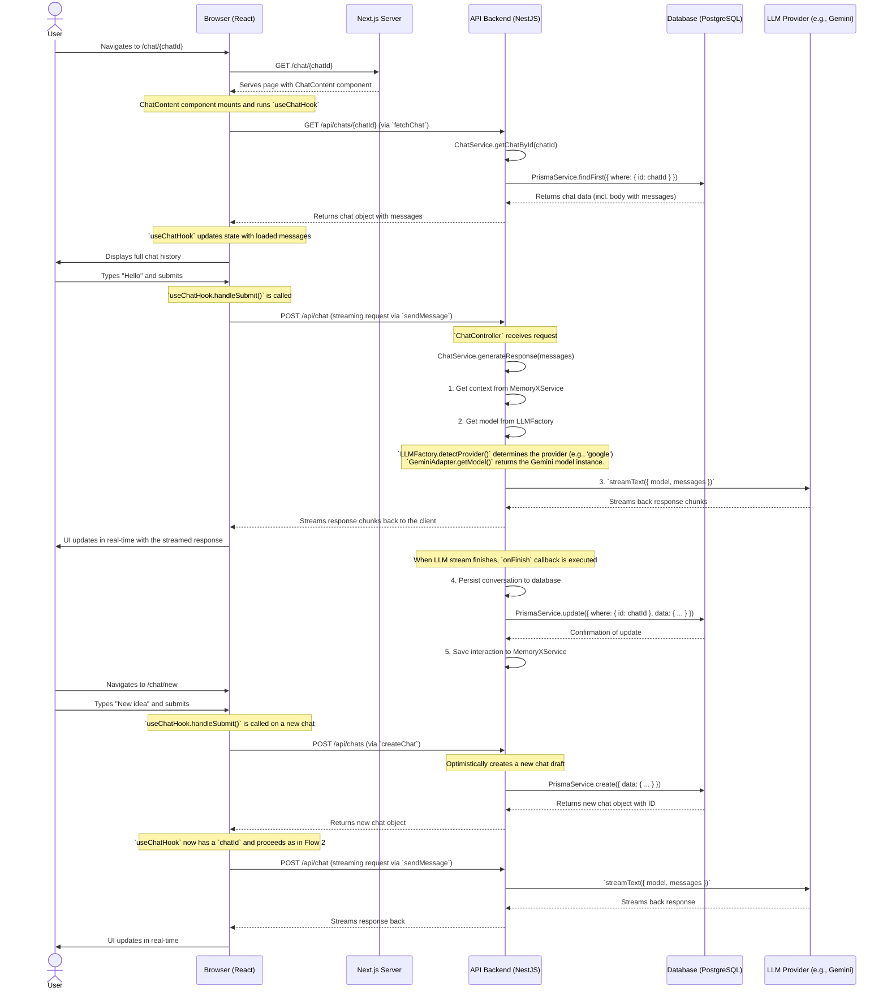

# Vanx 0.1.0

Flow

```mermaid
sequenceDiagram
    actor User
    participant Browser as Browser (React)
    participant NextServer as Next.js Server
    participant API as API Backend (NestJS)
    participant DB as Database (PostgreSQL)
    participant LLM as LLM Provider (e.g., Gemini)

    %% Flow 1: Loading an Existing Chat
    User->>Browser: Navigates to /chat/{chatId}
    Browser->>NextServer: GET /chat/{chatId}
    NextServer-->>Browser: Serves page with ChatContent component

    Note over Browser: ChatContent component mounts and runs `useChatHook`
    Browser->>API: GET /api/chats/{chatId} (via `fetchChat`)
    API->>API: ChatService.getChatById(chatId)
    API->>DB: PrismaService.findFirst({ where: { id: chatId } })
    DB-->>API: Returns chat data (incl. body with messages)
    API-->>Browser: Returns chat object with messages
    Note over Browser: `useChatHook` updates state with loaded messages
    Browser->>User: Displays full chat history

    %% Flow 2: Sending a New Message (in an existing chat)
    User->>Browser: Types "Hello" and submits
    Note over Browser: `useChatHook.handleSubmit()` is called

    Browser->>API: POST /api/chat (streaming request via `sendMessage`)
    Note over API: `ChatController` receives request
    API->>API: ChatService.generateResponse(messages)

    API->>API: 1. Get context from MemoryXService
    API->>API: 2. Get model from LLMFactory
    Note over API: `LLMFactory.detectProvider()` determines the provider (e.g., 'google')<br/>`GeminiAdapter.getModel()` returns the Gemini model instance.

    API->>LLM: 3. `streamText({ model, messages })`
    LLM-->>API: Streams back response chunks
    API-->>Browser: Streams response chunks back to the client
    Browser->>User: UI updates in real-time with the streamed response

    Note over API: When LLM stream finishes, `onFinish` callback is executed
    API->>API: 4. Persist conversation to database
    API->>DB: PrismaService.update({ where: { id: chatId }, data: { ... } })
    DB-->>API: Confirmation of update
    API->>API: 5. Save interaction to MemoryXService

    %% Flow 3: Creating a New Chat
    User->>Browser: Navigates to /chat/new
    User->>Browser: Types "New idea" and submits
    Note over Browser: `useChatHook.handleSubmit()` is called on a new chat

    Browser->>API: POST /api/chats (via `createChat`)
    Note over API: Optimistically creates a new chat draft
    API->>DB: PrismaService.create({ data: { ... } })
    DB-->>API: Returns new chat object with ID
    API-->>Browser: Returns new chat object

    Note over Browser: `useChatHook` now has a `chatId` and proceeds as in Flow 2
    Browser->>API: POST /api/chat (streaming request via `sendMessage`)
    API->>LLM: `streamText({ model, messages })`
    LLM-->>API: Streams back response
    API-->>Browser: Streams response back
    Browser->>User: UI updates in real-time
```